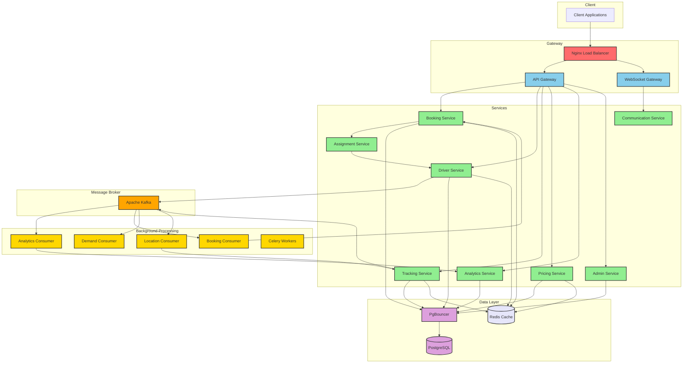

# 🚚 On-Demand Logistics Platform for Goods Transportation 🌐

This project is a personal solution for building a scalable Logistics Platform using Apache Kafka and other microservices.


## 🌟 Features

- 🚗 Real-time driver availability tracking
- 📊 Efficient data processing with Apache Kafka
- 🔄 Asynchronous task processing
- 🚀 Highly scalable microservices architecture
- 🧪 Comprehensive test suite
- 🌍 Real-time location tracking and geospatial indexing
- 💰 Dynamic pricing system
- 📅 Booking management with support for immediate and scheduled bookings
- 📈 Analytics service for data insights
- 🔔 Real-time notifications via WebSockets

## 🏗️ Architecture and Scalability

This service is built with scalability in mind, utilizing a microservices architecture, Apache Kafka for efficient message processing, and FastAPI for high-performance API development.

### Key Components:

1. **FastAPI Backend**: Asynchronous Python web framework for high-performance API development.
2. **Apache Kafka**: Distributed event streaming platform for handling high-volume data streams.
3. **PostgreSQL**: Robust relational database for persistent storage.
4. **Redis**: In-memory data store for caching and real-time data processing.
5. **Nginx**: High-performance load balancer and reverse proxy.
6. **Docker & Docker Compose**: Containerization for easy deployment and scaling.
7. **Celery**: Distributed task queue for background job processing.

## 🔄 Services and Functionalities

1. **Driver Availability Service**: Handles real-time updates of driver availability
2. **Booking Service**: Manages creation and processing of bookings
3. **Pricing Service**: Calculates dynamic pricing based on various factors
4. **Driver Assignment Service**: Efficiently assigns drivers to bookings
5. **Tracking Service**: Manages real-time location updates from drivers
6. **Analytics Service**: Processes and analyzes logistics data
7. **Communication Service**: Manages WebSocket connections for real-time updates
8. **Admin Service**: Provides endpoints for managing vehicles and other administrative tasks

For detailed information on each service and its workflows, please refer to the [Technical Documentation](./docs/documentation.md).

## 🚀 Scalability Features

- **Microservices Architecture**: Allows independent scaling of services.
- **Asynchronous Processing**: Utilizes FastAPI's asynchronous capabilities for non-blocking I/O operations.
- **Message Streaming**: Kafka for distributed event streaming and processing.
- **Caching**: Redis for fast data retrieval and reducing database load.
- **Load Balancing**: Nginx for distributing incoming traffic across multiple backend instances.
- **Containerization**: Docker for easy scaling of individual services.
- **Geospatial Indexing**: H3 for efficient location-based queries and operations.
- **Task Scheduling**: Celery for managing future bookings and related tasks.

## 🔮 Future Implementations

1. **Advanced Database Scaling**:
   - Implement database replication for improved read performance and fault tolerance.
   - Set up geolocation-based sharding to optimize query performance for location-based operations.
   - Explore multi-region database clusters for global scalability and reduced latency.

2. **Enhanced Caching Strategy**:
   - Implement a distributed caching layer using Redis Cluster for improved cache performance and scalability.
   - Develop intelligent cache invalidation mechanisms to ensure data consistency.

3. **Serverless Computing Integration**:
   - Explore serverless options (e.g., AWS Lambda, Google Cloud Functions) for specific microservices to improve scalability and reduce operational costs.

4. **Advanced Monitoring and Observability**:
   - Implement distributed tracing using tools like Jaeger or Zipkin for better visibility into microservices interactions.
   - Set up advanced alerting and anomaly detection systems.

5. **Edge Computing**:
   - Implement edge computing solutions for reduced latency in real-time location tracking and processing.

These future implementations will further enhance the scalability, performance, and feature set of the Driver Availability Service, ensuring its readiness for global-scale operations and emerging technologies.

## 🛠️ Setup and Deployment

1. Clone the repository
2. Set up environment variables (refer to `.env.example`)
3. Run `docker-compose up --build` to start all services
4. Access the API at `http://localhost:8000`

## 📚 API Documentation

Once the server is running, you can access the interactive API documentation at:

- Swagger UI: `http://localhost:8000/docs`
- ReDoc: `http://localhost:8000/redoc`

## 🧪 Testing

We use pytest for unit and integration testing. Run tests with:

```
pytest
```

For more details on our testing strategy, including unit, integration, and end-to-end testing, please refer to the [Technical Documentation](./docs/documentation.md#7-testing-strategy).

## 🔒 Security Considerations

This project implements various security measures, including:

- JWT-based authentication for API and WebSocket connections
- Rate limiting to prevent abuse
- Data encryption at rest and in transit
- Role-Based Access Control (RBAC)

For more information on security measures, please see the [Technical Documentation](./docs/documentation.md#5-security-considerations).

## 📈 Performance and Error Handling

The system is designed with performance and resilience in mind, implementing:

- Circuit breakers to prevent cascading failures
- Intelligent retry mechanisms for transient failures
- Comprehensive logging for all errors and exceptions

For more details, refer to the [Technical Documentation](./docs/documentation.md#6-error-handling-and-resilience).

## 🚀 Deployment and DevOps

The project uses:

- Docker for containerization
- Kubernetes for container orchestration and scaling
- Prometheus and Grafana for monitoring and alerting

For more information on deployment and DevOps practices, see the [Technical Documentation](./docs/documentation.md#8-deployment-and-devops).

## 🤝 Contributing

While this is a personal project, I welcome any feedback or suggestions you might have.


## 🌟 Additional Features

This project implements advanced features such as real-time location tracking, geospatial indexing, and an advanced microservices architecture. For detailed information on these implementations, please refer to the [Technical Documentation](./docs/documentation.md).
